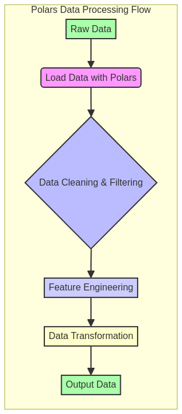

# High-Speed DataFrames with Polars


---

## 🇧🇷 DataFrames de Alta Velocidade com Polars

Este repositório explora e demonstra o uso da biblioteca **Polars para processamento de dados de alta performance**, focando em operações com DataFrames. Polars é uma alternativa robusta e extremamente rápida ao Pandas, construída em Rust, que aproveita o paralelismo e a eficiência de memória para lidar com grandes volumes de dados de forma otimizada. É ideal para **análise exploratória de dados, engenharia de features e pipelines de ETL** que exigem velocidade e escalabilidade.

### 🎯 Objetivo

O principal objetivo deste projeto é **fornecer exemplos práticos, benchmarks e tutoriais detalhados** para profissionais de dados que desejam migrar ou integrar Polars em seus fluxos de trabalho. Serão abordados desde os conceitos fundamentais de DataFrames em Polars até técnicas avançadas de otimização, integração com outras bibliotecas e comparação de performance com outras ferramentas, com foco em **operações de I/O eficientes, transformações complexas e avaliação lazy**.

### ✨ Destaques

- **I/O Otimizado**: Demonstrações de leitura e escrita eficientes de arquivos CSV e Parquet, aproveitando a performance do Polars para lidar com grandes volumes de dados.
- **Transformações Complexas e Expressões Avançadas**: Exemplos de como aplicar transformações de dados sofisticadas, incluindo agregação, filtragem e criação de novas colunas usando a poderosa sintaxe de expressões do Polars.
- **Avaliação Lazy (Lazy Evaluation)**: Exploração do paradigma de avaliação lazy do Polars, que permite a construção de planos de consulta otimizados, resultando em melhor performance e menor consumo de memória.
- **Operações de Join e Correlação**: Demonstrações de como realizar operações de join entre DataFrames e calcular correlações entre colunas, essenciais para análise de dados e engenharia de features.
- **Performance Excepcional**: Polars supera outras bibliotecas em velocidade e uso de memória para operações comuns de DataFrame, graças à sua implementação em Rust e paralelismo nativo.
- **API Intuitiva**: Exemplos que mostram a simplicidade e expressividade da API do Polars, facilitando a transição para usuários de Pandas.
- **Código Profissional**: Exemplos de código bem estruturados, seguindo as melhores práticas da indústria, com foco em modularidade, reusabilidade e manutenibilidade.
- **Documentação Completa**: Cada exemplo é acompanhado de documentação detalhada, benchmarks e casos de uso práticos para facilitar a compreensão e a aplicação.

### 🚀 Benefícios do Polars em Ação

O Polars oferece uma série de vantagens que o tornam uma escolha superior para processamento de dados de alta performance. Este projeto ilustra como esses benefícios são explorados:

1.  **Velocidade Incomparável:** Construído em Rust, o Polars aproveita a segurança de memória e a performance nativa para executar operações de DataFrame em velocidades impressionantes, superando o Pandas em muitos cenários, especialmente em I/O e transformações complexas.

2.  **Processamento Paralelo:** Utiliza todos os núcleos da CPU disponíveis por padrão, permitindo o processamento paralelo de dados sem a necessidade de configuração manual complexa, o que é evidente em operações de agregação e transformação.

3.  **Avaliação Lazy (Lazy Evaluation):** Permite a construção de planos de consulta otimizados, onde as operações são executadas apenas quando os resultados são realmente necessários, economizando recursos e tempo, como demonstrado na função `complex_lazy_evaluation`.

4.  **Eficiência de Memória:** Projetado para ser eficiente no uso de memória, o Polars pode lidar com datasets maiores do que o Pandas em máquinas com recursos limitados, tornando-o ideal para grandes volumes de dados.

5.  **API Expressiva:** Oferece uma API intuitiva e poderosa, que combina a facilidade de uso do Pandas com a performance de ferramentas de processamento distribuído, facilitando a escrita de código limpo e eficiente.

6.  **Integração com Arrow:** Baseado no Apache Arrow, o Polars garante interoperabilidade eficiente com outras ferramentas do ecossistema de dados, minimizando a cópia de dados e otimizando o fluxo de trabalho.

---

## 🇬🇧 High-Speed DataFrames with Polars

This repository explores and demonstrates the use of the **Polars library for high-performance data processing**, focusing on DataFrame operations. Polars is a robust and extremely fast alternative to Pandas, built in Rust, which leverages parallelism and memory efficiency to handle large volumes of data optimally. It is ideal for **exploratory data analysis, feature engineering, and ETL pipelines** that require speed and scalability.

### 🎯 Objective

The main objective of this project is to **provide practical examples, benchmarks, and detailed tutorials** for data professionals who wish to migrate to or integrate Polars into their workflows. It will cover everything from the fundamental concepts of DataFrames in Polars to advanced optimization techniques, integration with other libraries, and performance comparison with other tools, with a focus on **efficient I/O operations, complex transformations, and lazy evaluation**.

### ✨ Highlights

- **Optimized I/O**: Demonstrations of efficient reading and writing of CSV and Parquet files, leveraging Polars' performance to handle large data volumes.
- **Complex Transformations and Advanced Expressions**: Examples of how to apply sophisticated data transformations, including aggregation, filtering, and creating new columns using Polars' powerful expression syntax.
- **Lazy Evaluation**: Exploration of Polars' lazy evaluation paradigm, which allows for the construction of optimized query plans, resulting in better performance and lower memory consumption.
- **Join and Correlation Operations**: Demonstrations of how to perform join operations between DataFrames and calculate correlations between columns, essential for data analysis and feature engineering.
- **Exceptional Performance**: Polars outperforms other libraries in speed and memory usage for common DataFrame operations, thanks to its Rust implementation and native parallelism.
- **Intuitive API**: Examples showcasing the simplicity and expressiveness of the Polars API, making it easy for Pandas users to transition.
- **Professional Code**: Well-structured code examples, following industry best practices, with a focus on modularity, reusability, and maintainability.
- **Complete Documentation**: Each example is accompanied by detailed documentation, benchmarks, and practical use cases to facilitate understanding and application.

### 📊 Visualization



*Diagrama ilustrativo do fluxo de processamento de dados com Polars, destacando as etapas de ingestão, transformação e saída.*


---

## 🛠️ Tecnologias Utilizadas / Technologies Used

| Categoria         | Tecnologia      | Descrição                                                                 |
| :---------------- | :-------------- | :------------------------------------------------------------------------ |
| **Linguagem**     | Python          | Linguagem principal para desenvolvimento e interface com Polars.          |
| **DataFrames**    | Polars          | Biblioteca de DataFrames de alta performance, construída em Rust.         |
| **Serialização**  | CSV, Parquet    | Formatos de arquivo suportados para leitura e escrita otimizadas.         |
| **Testes**        | `pytest`        | Framework de testes para validação de funcionalidades e performance.      |
| **Diagramação**   | Mermaid         | Para criação de diagramas de arquitetura e fluxo de dados no README.      |

---

## 📁 Repository Structure

```
polars-high-speed-dataframes/
├── src/
│   ├── __init__.py
│   └── polars_demo.py           # Lógica principal com exemplos de uso do Polars
├── data/                        # Dados de exemplo (CSV, Parquet) para benchmarks e testes
├── images/                      # Imagens e gráficos para o README e documentação
├── tests/                       # Testes unitários e de integração para as implementações
├── docs/                        # Documentação adicional, tutoriais e guias de performance
├── scripts/                     # Scripts utilitários para automação e execução de benchmarks
├── requirements.txt             # Dependências Python
└── README.md                    # Este arquivo
```

---

## 🚀 Getting Started

Para começar, clone o repositório e explore os diretórios `src/` e `docs/` para exemplos detalhados e instruções de uso. Certifique-se de ter as dependências necessárias instaladas.

### Pré-requisitos

- Python 3.9+
- `pip` (gerenciador de pacotes Python)

### Instalação

```bash
git clone https://github.com/GabrielDemetriosLafis/polars-high-speed-dataframes.git
cd polars-high-speed-dataframes

# Instalar dependências Python
pip install -r requirements.txt
```

### Exemplo de Uso Avançado (Python)

O exemplo abaixo demonstra a inicialização da classe `PolarsProcessor`, a criação de DataFrames, operações de agrupamento e agregação, adição de novas colunas, operações encadeadas, avaliação lazy complexa, joins com outros DataFrames e cálculo de correlação. Este código ilustra a flexibilidade e o poder do Polars para manipulação de dados de alta performance.

```python
import polars as pl
from src.polars_demo import PolarsProcessor
import os

if __name__ == "__main__":
    print("=" * 60)
    print("Polars High-Speed DataFrames Demo")
    print("=" * 60)

    processor = PolarsProcessor()

    # Criar um DataFrame de exemplo
    data = {
        "name": ["Alice", "Bob", "Charlie", "David", "Eve", "Frank", "Grace", "Heidi"],
        "age": [25, 30, 35, 28, 40, 22, 32, 45],
        "city": ["New York", "London", "New York", "Paris", "London", "New York", "Paris", "London"],
        "salary": [50000, 70000, 60000, 55000, 80000, 45000, 65000, 90000]
    }
    df = pl.DataFrame(data)
    print("\nOriginal DataFrame:")
    print(df)

    # --- 1. Agrupar e agregar ---
    print("\n--- 1. Média salarial por cidade: ---")
    avg_salary_df = processor.group_and_aggregate(df)
    print(avg_salary_df)

    # --- 2. Adicionar coluna de bônus ---
    print("\n--- 2. DataFrame com bônus (10%): ---")
    df_with_bonus = processor.add_bonus_column(df, 0.10)
    print(df_with_bonus)

    # --- 3. Operações encadeadas ---
    print("\n--- 3. Operações encadeadas (idade > 25, 5% bônus): ---")
    chained_df = processor.chain_operations(df, 25, 0.05)
    print(chained_df)

    # --- 4. Avaliação Lazy Complexa ---
    print("\n--- 4. Avaliação Lazy Complexa (idade > 25, avg_salary_city < 60000): ---")
    complex_lazy_df = processor.complex_lazy_evaluation(df, 25, 60000)
    print(complex_lazy_df)

    # --- 5. Join com outro DataFrame ---
    print("\n--- 5. DataFrame após join com informações de departamento: ---")
    other_data = {
        "name": ["Alice", "Bob", "Charlie", "David", "Eve"],
        "department": ["HR", "Engineering", "Sales", "Marketing", "Engineering"]
    }
    other_df = pl.DataFrame(other_data)
    joined_df = processor.join_with_another_dataframe(df, other_df, "name")
    print(joined_df)

    # --- 6. Calcular correlação ---
    print("\n--- 6. Correlação entre idade e salário: ---")
    correlation = processor.calculate_correlation(df, "age", "salary")
    print(f"  Correlação: {correlation:.2f}")

    # --- 7. Leitura e Escrita de Arquivos (CSV e Parquet) ---
    print("\n--- 7. Demonstração de Leitura e Escrita de Arquivos ---")
    # Criar um arquivo CSV de exemplo
    csv_file = "data/sample.csv"
    df.write_csv(csv_file)
    print(f"  DataFrame salvo em {csv_file}")

    # Ler o arquivo CSV
    read_csv_df = processor.read_csv_file(csv_file)
    print("  DataFrame lido de CSV:")
    print(read_csv_df)

    # Criar um arquivo Parquet de exemplo
    parquet_file = "data/sample.parquet"
    df.write_parquet(parquet_file)
    print(f"  DataFrame salvo em {parquet_file}")

    # Ler o arquivo Parquet
    read_parquet_df = processor.read_parquet_file(parquet_file)
    print("  DataFrame lido de Parquet:")
    print(read_parquet_df)

    # Limpar arquivos gerados
    if os.path.exists(csv_file):
        os.remove(csv_file)
    if os.path.exists(parquet_file):
        os.remove(parquet_file)

    print("\n==================================================")
    print("Demonstração Concluída.")
    print("==================================================")
```

---

## 🤝 Contribuição

Contribuições são bem-vindas! Sinta-se à vontade para abrir issues, enviar pull requests ou sugerir melhorias. Por favor, siga as diretrizes de contribuição.

---

## 📝 Licença

Este projeto está licenciado sob a Licença MIT - veja o arquivo [LICENSE](LICENSE) para detalhes.

---

**Autor:** Gabriel Demetrios Lafis  \n**Ano:** 2025