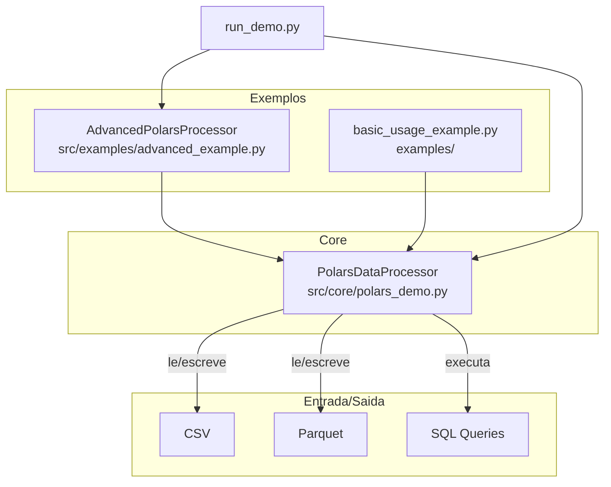
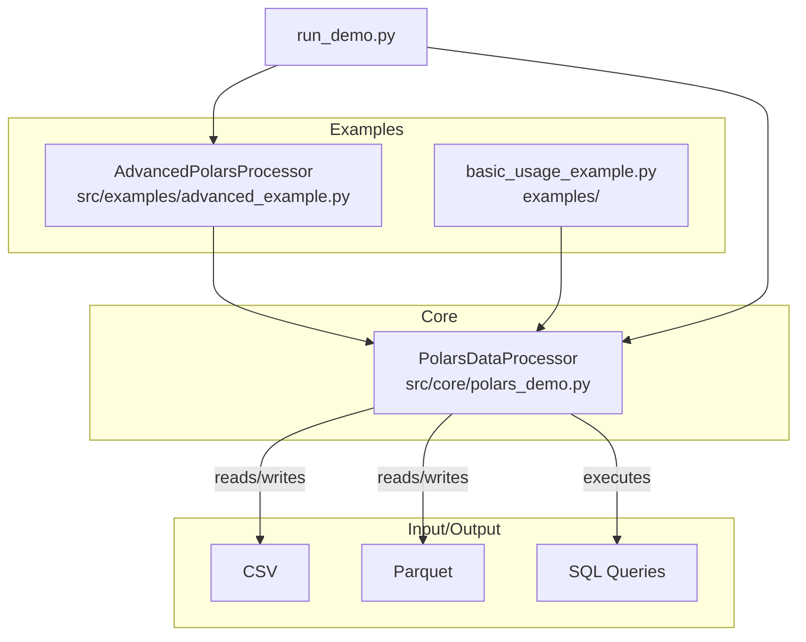

# Polars - Demonstracao de DataFrames de Alta Performance

Projeto demonstrativo do uso da biblioteca Polars para processamento de dados em Python. Implementa uma classe wrapper com operacoes comuns: leitura/escrita CSV e Parquet, filtragem, estatisticas agrupadas, colunas derivadas, funcoes de janela, tratamento de nulos, joins e queries SQL.

[](https://python.org)
[](https://pola.rs)
[](LICENSE)

[English](#english)

---

## Indice

- [Visao Geral](#visao-geral)
- [Arquitetura](#arquitetura)
- [Estrutura do Projeto](#estrutura-do-projeto)
- [Como Usar](#como-usar)
- [Testes](#testes)
- [Autor](#autor)

## Visao Geral

Este repositorio contem uma classe `PolarsDataProcessor` que encapsula operacoes comuns do Polars, e um exemplo avancado (`AdvancedPolarsProcessor`) que gera dados de vendas sinteticos e demonstra agregacoes, joins e analises.

**Funcionalidades implementadas:**

- Leitura e escrita de CSV e Parquet
- Filtragem com expressoes Polars
- Estatisticas agrupadas (media, mediana, min, max, desvio padrao)
- Colunas derivadas (concatenacao, categorizacao, calculos)
- Funcoes de janela (media movel, rank por particao)
- Tratamento de nulos (media, mediana, moda, forward/backward fill, drop)
- Joins entre DataFrames
- Queries SQL via `pl.SQLContext`

## Arquitetura



## Estrutura do Projeto

```
polars-high-speed-dataframes/
├── src/
│   ├── __init__.py
│   ├── core/
│   │   ├── __init__.py
│   │   └── polars_demo.py         # PolarsDataProcessor (classe principal)
│   └── examples/
│       ├── __init__.py
│       └── advanced_example.py    # AdvancedPolarsProcessor (demo avancado)
├── examples/
│   └── basic_usage_example.py     # Exemplo basico de uso
├── tests/
│   ├── test_polars_demo.py        # Testes da classe principal
│   └── test_advanced_example.py   # Testes do exemplo avancado
├── run_demo.py                    # Script de demonstracao
├── requirements.txt
├── LICENSE
└── README.md
```

## Como Usar

```bash
# Clonar o repositorio
git clone https://github.com/galafis/polars-high-speed-dataframes.git
cd polars-high-speed-dataframes

# Instalar dependencias
pip install -r requirements.txt

# Executar demonstracao
python run_demo.py

# Executar exemplo basico
python examples/basic_usage_example.py
```

## Testes

```bash
# Executar todos os testes
pytest tests/ -v

# Com cobertura
pytest tests/ --cov=src --cov-report=term
```

## Autor

**Gabriel Demetrios Lafis**
- GitHub: [@galafis](https://github.com/galafis)
- LinkedIn: [Gabriel Demetrios Lafis](https://linkedin.com/in/gabriel-demetrios-lafis)

## Licenca

Este projeto esta licenciado sob a Licenca MIT - veja o arquivo [LICENSE](LICENSE) para detalhes.

---

## English

# Polars - High-Performance DataFrame Demo

A demonstration project showcasing the Polars library for data processing in Python. Implements a wrapper class with common operations: CSV and Parquet I/O, filtering, grouped statistics, derived columns, window functions, null handling, joins, and SQL queries.

### Overview

This repository contains a `PolarsDataProcessor` class that wraps common Polars operations, and an advanced example (`AdvancedPolarsProcessor`) that generates synthetic sales data and demonstrates aggregations, joins, and analysis.

**Implemented features:**

- CSV and Parquet read/write
- Filtering with Polars expressions
- Grouped statistics (mean, median, min, max, std)
- Derived columns (concatenation, categorization, calculations)
- Window functions (rolling mean, rank by partition)
- Null handling (mean, median, mode, forward/backward fill, drop)
- DataFrame joins
- SQL queries via `pl.SQLContext`

### Architecture



### Usage

```bash
# Clone the repository
git clone https://github.com/galafis/polars-high-speed-dataframes.git
cd polars-high-speed-dataframes

# Install dependencies
pip install -r requirements.txt

# Run demo
python run_demo.py

# Run basic example
python examples/basic_usage_example.py
```

### Tests

```bash
# Run all tests
pytest tests/ -v

# With coverage
pytest tests/ --cov=src --cov-report=term
```

### License

This project is licensed under the MIT License - see the [LICENSE](LICENSE) file for details.
